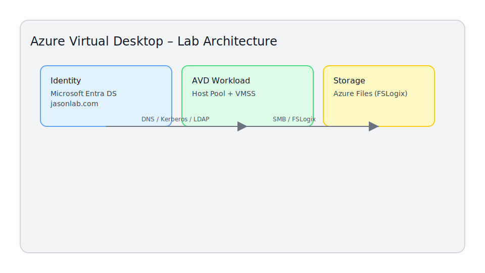

# Azure Virtual Desktop – Home Lab

This repository contains a hands-on **Azure Virtual Desktop (AVD)** lab designed to mirror a realistic enterprise deployment while staying small enough to run in a personal subscription.

It focuses on:

- **Microsoft Entra Domain Services (AADDS)**
- **Azure Virtual Desktop (Host Pools + VMSS)**
- **Azure Files + FSLogix profile containers**
- **Kerberos-based authentication**
- **Clean virtual network design with peering + custom DNS**

---

## 📌 Contents

- `docs/`
  - `00-Architecture.md` – High-level architecture + diagrams
  - `01-Networking.md` – VNets, subnets, peering, DNS
  - `02-AADDS.md` – Microsoft Entra Domain Services setup
  - `03-Storage-FSLogix.md` – Storage account + Azure Files for FSLogix
  - `04-AVD-HostPool.md` – Host pool + VMSS deployment
  - `05-Image-Management.md` – Image strategy + Shared Image Gallery (SIG)
  - `06-FSLogix-Config.md` – FSLogix registry / GPO config
  - `07-Autoscale-Monitoring.md` – Scaling plans + monitoring
  - `08-Troubleshooting.md` – Common issues and fixes
- `scripts/` – Helper scripts and ARM/Bicep stubs

---

## 🗺️ Lab Architecture (High Level)



The lab is built around a single resource group:

```
RG-AVD-Lab
├─ Microsoft Entra Domain Services (jasonlab.com)
│   └─ aadds-vnet (10.0.0.0/24)
│       └─ AADDS-Subnet (Domain Controllers)
│
├─ VNET-AVD-Lab (10.1.0.0/16)
│   ├─ AVD-Hosts      (10.1.1.0/24)
│   └─ Management     (10.1.2.0/24)
│
├─ Storage Account (FSLogix Profiles)
│   └─ File Share: fslogix
│
└─ Azure Virtual Desktop
    ├─ Host Pool
    ├─ VM Scale Set
    └─ Application Group + Workspace
```

---

## 🚀 Quick Start

1. Create **RG-AVD-Lab** in your preferred region (e.g. Australia East).
2. Deploy **Microsoft Entra Domain Services** (`jasonlab.com`) into its own VNet (`aadds-vnet`).
3. Create **VNET-AVD-Lab (10.1.0.0/16)** with `AVD-Hosts` and `Management` subnets.
4. Peer `VNET-AVD-Lab` ⇄ `aadds-vnet` (bi-directional, virtual network access allowed).
5. Point **VNET-AVD-Lab DNS** at the AADDS IPs (e.g. `10.0.0.4`, `10.0.0.5`).
6. Create a **StorageV2** account for FSLogix and a `fslogix` Azure File share.
7. Proceed with AVD host pool + VMSS deployment (see `docs/04-AVD-HostPool.md`).

---

## 🧱 Status

This lab currently includes:

- ✅ Network + identity foundation (AADDS + VNETs + DNS)
- ✅ Storage account + FSLogix share scaffold
- 🕒 AVD host pool, VMSS, and image flow – in progress
- 🕒 Autoscale + monitoring – in progress

This repo is intended to grow over time as additional AVD scenarios are explored.
