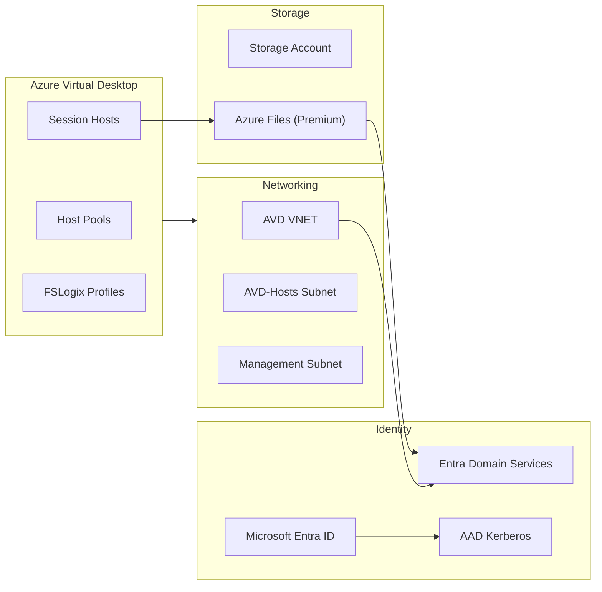
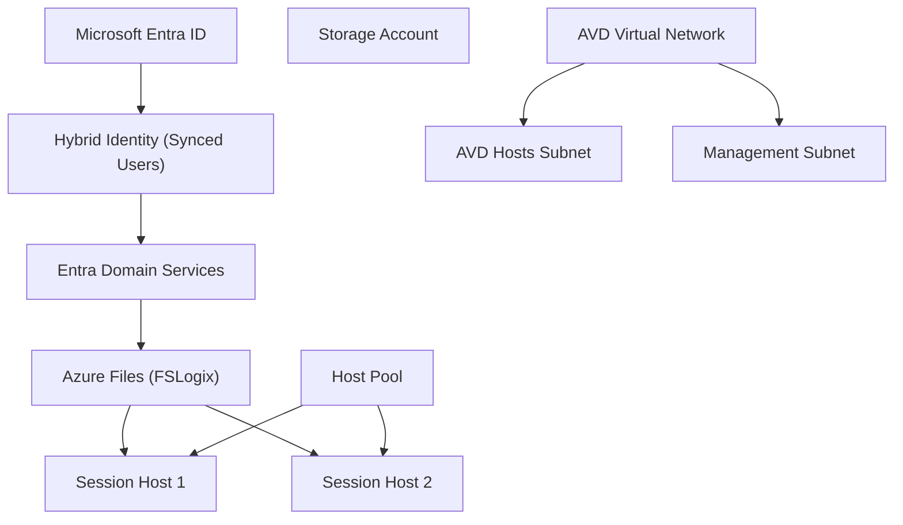
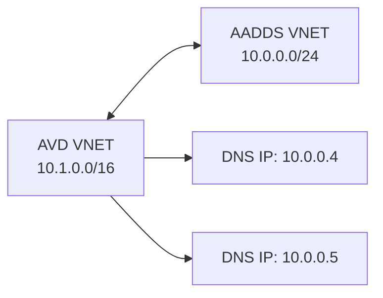
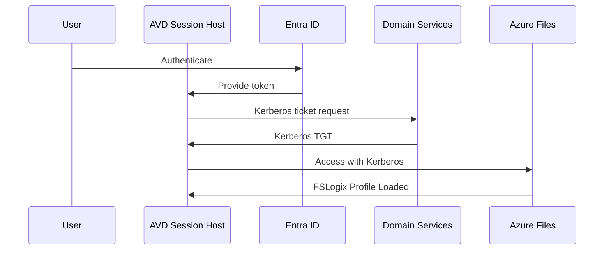

# Azure Virtual Desktop – Architecture Overview

## 🏗️ High-Level Architecture

---

## 📌 Architecture Components Table

| Component | Purpose | Notes |
|----------|---------|-------|
| **Host Pool** | Logical grouping of session hosts | Used by RemoteApp & Desktop |
| **Session Hosts** | VMs running Windows 11 multisession | Joined to AADDS |
| **FSLogix** | User profile container | Stored on Azure Files |
| **Azure Files Premium** | Profile storage | Requires AD-based auth |
| **AADDS** | Domain service required for Kerberos | Provides LDAP/Kerberos |
| **AVD VNET** | Networking backbone | Peered with AADDS VNET |
| **Kerberos for Azure Files** | Auth without domain join | Requires hybrid identity |

---

## 🧩 Logical Layout

---

## 🌐 Networking Diagram (VNET Peering + DNS)

---

## 🔐 Identity Flow (Kerberos for Azure Files)

---

## 🏷️ Technology Badges

---

## 🧱 Detailed Architecture Breakdown

### 1. **Identity**
- Microsoft Entra ID (Primary authentication)
- AADDS for Kerberos (required for Azure Files auth)
- Hybrid identities synced via Cloud Sync

### 2. **Compute**
- Windows 11 multisession hosts
- Autoscale recommended (Scaling Plan)
- Registered into the Host Pool automatically via ARM/Bicep/CLI

### 3. **Storage**
- Azure Files Premium (LRS or ZRS)
- FSLogix Profile Container
- Kerberos enabled

### 4. **Networking**
- Dedicated VNET (10.1.0.0/16)
- Subnets:
  - AVD-Hosts
  - Management
- VNET Peering:
  - AVD-VNET ↔ AADDS-VNET
- DNS:
  - Custom DNS pointing to AADDS IPs
  - Conditional forwarding automatically handled by AADDS

---

## 📄 Appendix – Resource Naming

| Resource | Example Name |
|---------|---------------|
| Host Pool | `avd-hp-prod` |
| Resource Group | `RG-AVD-Lab` |
| Storage Account | `stavdprofilesnnn` |
| VNET | `VNET-AVD-Lab` |
| Subnets | `AVD-Hosts`, `Management` |

---

## ✔️ Summary

This architecture provides:

- Secure hybrid identity with Kerberos
- Fast profile load times using Azure Files Premium
- Scalable and modular VNET design
- Clear separation of compute, identity, storage, and network

Perfect for **production-grade AVD**, **lab environments**, or **enterprise landing zones**.
