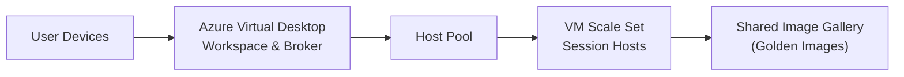
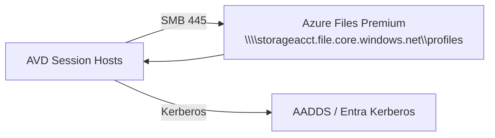
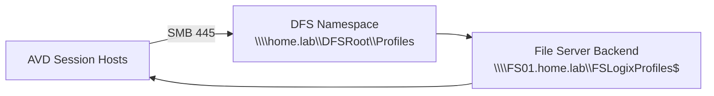

# 00 – Azure Virtual Desktop Architecture (Storage Options)


---

# 🧭 1. Overview
This document provides the updated **AVD Architecture Overview**, now including a clearly structured **“Choose Azure Files OR DFS”** storage decision model.

---

# 🧱 2. Core AVD Architecture



This remains unchanged — storage only impacts where FSLogix profile containers live.

---

# 🎯 3. Storage Architecture (Choose One)

Azure Virtual Desktop supports multiple backend storage options for FSLogix profile containers.  
My environment supports **two valid architectures**:

---

# 🔵 Option A — Azure Files Premium (Enterprise Production)

**Use for:** Hospitals, large orgs, compliance environments, real AVD deployments.

### ✔ Features
- Highly available, resilient storage
- Kerberos authentication (AADDS or Entra ID)
- Azure Backup & snapshots
- Microsoft-recommended for production
- Predictable throughput & scalability

### ✔ Architecture



### ✔ Choose Azure Files when:
- Deploying AVD in **Enterprise environments**
- Need DR, snapshots, retention
- Want Microsoft supportability
- Running large concurrent user workloads

---

# 🟠 Option B — Local DFS / SMB Storage (Home Lab or Hybrid On-Prem)

**Use for:**  
Home labs, PoC environments, or when enterprise has existing file servers.

Example DFS path used in my lab:

```
\\home.lab\DFSRoot\Profiles
```

### ✔ Features
- Identical FSLogix behaviour to Azure Files
- Uses Windows NTFS permissions
- Supports Kerberos (if domain joined)
- Fully supports multi-session AVD
- Zero Azure Files cost
- Leverages existing infrastructure

### ✔ Architecture



### ✔ Choose DFS when:
- Building a realistic **AVD home lab**
- Avoiding Azure Files cost
- Simulating full enterprise FSLogix behaviour
- Testing DFS, NTFS permissions & SMB throughput

---

# 🟣 4. What Stays the Same in Both Architectures

| Component | Azure Files | DFS |
|----------|-------------|------|
| FSLogix profile container (VHDX) | ✔ | ✔ |
| Redirections.xml | ✔ | ✔ |
| Office Container | ✔ | ✔ |
| Cloud Cache support | ✔ | ✔ |
| Login behaviour | ✔ | ✔ |
| Multi-session roaming profile support | ✔ | ✔ |

🎉 **FSLogix does not care where the VHDX lives — only that SMB is reachable.**

---

# 🟤 5. What Changes Between Azure & DFS

| Feature | Azure Files | DFS |
|--------|-------------|------|
| Identity | Kerberos via AADDS/Entra | AD DS or NTLM fallback |
| Backup | Azure Backup, snapshots | Backup tools (Veeam, etc.) |
| Throughput | Azure-managed scaling | Local hardware performance |
| Cost | Consumption-based | Zero cloud cost |
| DR | Geo-zone redundancy | Depends on DFS-R strategy |
| Permissions | RBAC + NTFS | NTFS only |

---

# 🧭 6. Storage Decision Model

| Scenario | Recommended Storage |
|----------|---------------------|
| **Production deployment** | Azure Files Premium |
| Home lab, cost-sensitive | DFS / SMB |
| High compliance requirement | Azure Files |
| Existing on-prem file servers | DFS |
| DR-critical workloads | Azure Files or Azure NetApp Files |

---

# 🔧 7. FSLogix Path Examples

### Azure Files
```
\\storageacct.file.core.windows.net\profiles
```

### DFS (Home Lab)
```
\\home.lab\DFSRoot\Profiles
```

FSLogix registry key example:

```reg
"VHDLocations"=multi:"\\\\home.lab\\DFSRoot\\Profiles"
```

---

# 🏁 8. Summary

You now have two valid, documented FSLogix storage backends:

### ✔ Azure Files Premium  
Enterprise-grade, highly available, Microsoft-supported.

### ✔ Local DFS File Server  
Perfect for a home lab, nearly identical behaviour to production.
