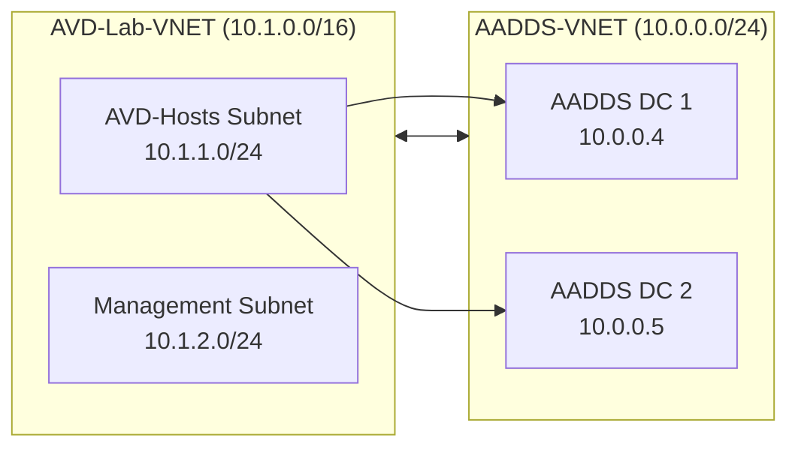
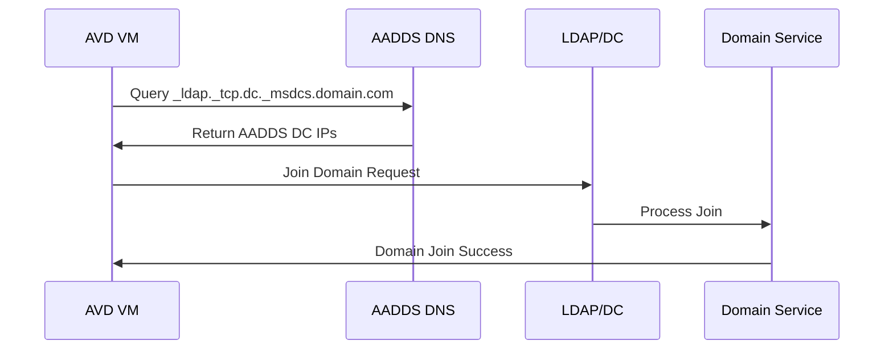
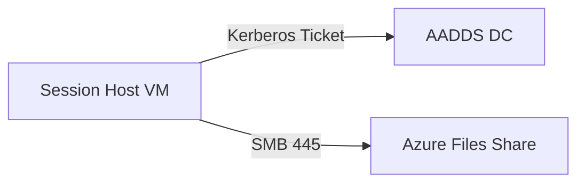

# 01 – Azure Virtual Desktop Networking Architecture


---

# 🧭 1. Overview

This document defines the **networking architecture** required for a secure and production-aligned Azure Virtual Desktop (AVD) environment.  
It covers:

- VNET design  
- Subnet layout  
- NSGs  
- DNS architecture  
- Kerberos and AADDS requirements  
- VNET Peering  
- Routing flows  
- Session Host connectivity requirements  

This mirrors Microsoft best practices while remaining lightweight and appropriate for a lab or PoC.

---

# 🌐 2. High-Level Networking Diagram



---

# 🧩 3. Virtual Network Layout

The deployment uses a **dual-VNET architecture**, separating identity from compute for security and clarity.

| VNET Name | Address Space | Purpose |
|----------|---------------|---------|
| **AADDS-VNET** | `10.0.0.0/24` | Entra Domain Services (DCs, DNS, Kerberos) |
| **VNET-AVD-Lab** | `10.1.0.0/16` | AVD session hosts, management services, Bastion |

### Why this matters
- AADDS requires its own dedicated VNET and subnet.  
- AVD hosts must reach DCs over secure ports (Kerberos, LDAP, DNS).  
- DNS overrides must be applied to the AVD VNET so domain join works.

---

# 🧱 4. Subnet Structure

### AADDS VNET Subnets
| Subnet | CIDR | Description |
|--------|------|-------------|
| `AADDS-Subnet` | `10.0.0.0/24` | Required subnet for managed domain controllers |

### AVD VNET Subnets
| Subnet | CIDR | Description |
|--------|------|-------------|
| `AVD-Hosts` | `10.1.1.0/24` | Session Host VMs (pooled/multisession) |
| `Management` | `10.1.2.0/24` | Bastion / admin tooling / jump-box |

---

# 📡 5. DNS Architecture (Critical)

AVD **WILL NOT FUNCTION** unless DNS is configured correctly.

### 5.1 Required DNS Servers
AVD VNET **must** use the AADDS DNS IPs:

```
10.0.0.4
10.0.0.5
```

These are automatically provisioned when the managed domain is deployed.

### 5.2 Why this is required

| Feature | DNS Dependency |
|---------|----------------|
| Domain Join | Requires AADDS DNS for SRV lookups |
| Kerberos | Requires AADDS KDC |
| FSLogix | Requires SMB + Kerberos auth |
| AVD Agent Registration | Requires domain membership |

### 5.3 CLI Configuration (UI bug workaround)

```bash
az network vnet update   --resource-group RG-AVD-Lab   --name VNET-AVD-Lab   --dns-servers 10.0.0.4 10.0.0.5
```

Verification:

```pwsh
(Get-AzVirtualNetwork -Name "VNET-AVD-Lab" -ResourceGroupName "RG-AVD-Lab").DhcpOptions
```

---

# 🔗 6. VNET Peering

VNET Peering is configured **bidirectionally**:

```text
AADDS-VNET  ⇄  VNET-AVD-Lab
```

### Required Peering Settings

| Setting | AVD → AADDS | AADDS → AVD |
|---------|-------------|-------------|
| Allow Virtual Network Access | ✅ | ✅ |
| Allow Forwarded Traffic | ✅ | ✅ |
| Use Remote Gateways | ❌ | ❌ |

### Purpose of Peering
| Dependency | Why Needed |
|------------|------------|
| Domain Join | AVD VMs reach LDAP/Kerberos |
| DNS | AVD VNET forwards lookups to AADDS |
| FSLogix | Kerberos ticket path to Azure Files |
| Kerberos | Session hosts receive KDC tickets |

---

# 🔒 7. Network Security Groups (NSGs)

Recommended NSGs:

## AVD-Hosts Subnet NSG
| Direction | Port | Purpose |
|-----------|------|---------|
| Outbound | 443 | AVD broker + Gateway |
| Outbound | 445 | FSLogix to Azure Files |
| Outbound | 88 | Kerberos to AADDS |
| Outbound | 389 | LDAP to AADDS |
| Outbound | 53 | DNS to AADDS |
| Inbound | 3389 | **Only if NOT using Bastion** |

## Management Subnet NSG
- Allow RDP inbound from admin IP range
- Allow all outbound required for admin tools

---

# 🔁 8. Routing & Traffic Flow

### Domain Join Flow



### FSLogix Traffic Flow



---

# 🧪 9. Connectivity Requirements

### Outbound Internet Dependencies
AVD session hosts must reach:

| Service | Purpose |
|---------|---------|
| `*.wvd.microsoft.com` | Broker |
| `*.servicebus.windows.net` | Diagnostics |
| `*.core.windows.net` | Azure Files (FSLogix) |
| `login.microsoftonline.com` | Entra ID auth |

### Required Protocols

| Protocol | Required For |
|----------|--------------|
| SMB 3.1.1 | FSLogix profiles |
| HTTPS | AVD broker agent |
| Kerberos | Azure Files authentication |
| LDAP/LDAPS | Domain join |

---

# 🧩 10. Troubleshooting Networking Issues

### Common Issues & Fixes

| Issue | Cause | Fix |
|--------|--------|------|
| Domain join fails | Wrong DNS | Set DNS to AADDS IPs |
| FSLogix VHDX not mounting | SMB blocked | Allow outbound 445 |
| Machines not registering | No outbound 443 | Allow HTTPS |
| AVD can't reach DCs | Peering misconfigured | Enable forwarded traffic |
| Kerberos failures | Time drift | Ensure VM sync with Azure time |

---

# ✔ Summary

This networking architecture ensures:

- Reliable domain join  
- Kerberos-based FSLogix access  
- Secure routing  
- Minimal, correct peering  
- Full AVD functionality  

It mirrors enterprise-grade principles while remaining simple enough for a lab or learning environment.

