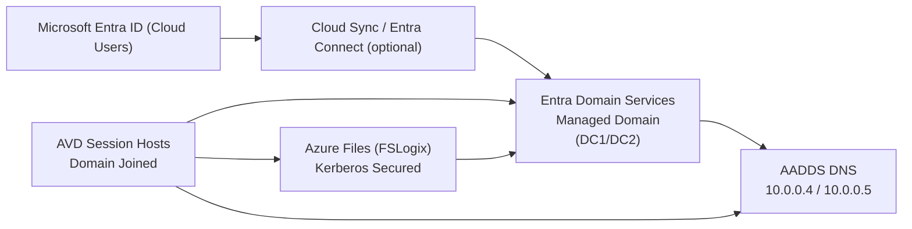
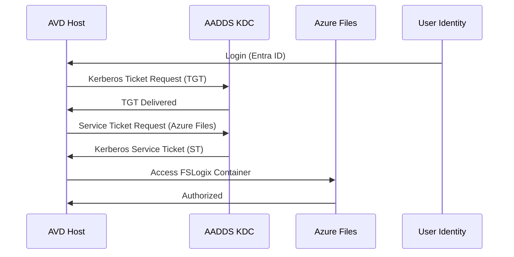

# 02 – Microsoft Entra Domain Services (AADDS)  


---

# 🧭 1. Overview

**Microsoft Entra Domain Services (AADDS)** provides domain-join, LDAP, Kerberos, NTLM, and Group Policy compatibility **without deploying domain controllers**.  
It is the recommended identity backend for Azure Virtual Desktop **FSLogix profile authentication**, unless you are using Native Entra ID Join (still emerging).

In this architecture:

- AADDS provides **Kerberos** for Azure Files  
- Session Hosts **domain-join** to AADDS  
- DNS resolution is provided by AADDS  
- No on-prem Active Directory is required  

---

# 🧱 2. AADDS Architecture Diagram



---

# 🧩 3. Why Use AADDS for AVD?

| Requirement | Does AADDS solve it? | Notes |
|------------|-----------------------|-------|
| Domain Join for Session Hosts | ✅ | No domain controllers required |
| Kerberos for Azure Files | ✅ | Required for FSLogix without account keys |
| LDAP/LDAPS Compatibility | ✅ | Supports legacy protocols |
| Group Policy | ⚠️ | Basic GPO support (limited) |
| Seamless with Entra ID | ⚠️ | Sync required for Groups & Users |

**In short:**  
AADDS gives AVD everything it needs **without an on-prem AD**.

---

# 🔐 4. Identity & Sync Model

AADDS is **read-only** — it **cannot** create or modify objects.

It receives objects from Entra ID through:

### **Option A – Entra Cloud Sync (Recommended)**
Lightweight, supports password hash sync.

### **Option B – Azure AD Connect**
Older method, not preferred for cloud-only labs.

### Sync Rules
- Usernames  
- Password hashes  
- Group memberships  
- Security groups for FSLogix access  

---

# 🌐 5. AADDS VNET & Subnet Requirements

AADDS **must** run in its own dedicated subnet.

| Resource | Requirement |
|----------|-------------|
| Dedicated subnet | Yes |
| Minimum size | `/24` |
| NSG allowed | Yes |
| Peering allowed | Yes |
| Custom DNS | Provided by AADDS automatically |

Example:

```
AADDS-VNET:       10.0.0.0/24
AADDS Subnet:     10.0.0.0/24
AADDS DNS:        10.0.0.4, 10.0.0.5
```

---

# 🔎 6. DNS Behaviour

AADDS acts as **authoritative DNS** for:

- The AADDS domain (e.g., `contoso.local`)
- Kerberos SRV records
- LDAP records
- `_msdcs` zone

The AVD VNET **must use these DNS servers**:

```
10.0.0.4
10.0.0.5
```

Otherwise:

❌ Session hosts cannot domain-join  
❌ Kerberos for Azure Files fails  
❌ FSLogix profile mount fails  

---

# 📡 7. Kerberos for Azure Files (Mandatory for FSLogix)

AADDS provides:

- **Key Distribution Center (KDC)**  
- Kerberos ticket issuing  
- Service Principal Name (SPN) registration  
- Machine account identity validation  

Azure Files uses:

```
cifs/storagename.file.core.windows.net
```

AADDS automatically handles this when Kerberos is enabled on the storage account.

### Flow Diagram



---

# 🧾 8. Group Requirements for FSLogix

Create a group:

```
FSLogix-Users
```

Assign:

- All AVD users  
- Apply Azure Role: **Storage File Data SMB Share Contributor**

AADDS sync ensures this group appears inside the managed domain.

---

# 🛠 9. Domain Join Requirements for AVD Hosts

AVD VMs join:

```
yourdomain.onmicrosoft.com (managed domain)
```

They must reach:

| Protocol | Port | Use |
|----------|------|-----|
| Kerberos | 88 | Authentication |
| LDAP | 389 | Directory queries |
| LDAPS | 636 | Secure LDAP |
| SMB | 445 | Profile access |
| DNS | 53 | Domain resolution |

Outbound traffic must be allowed on 443 for AVD broker.

---

# 🧰 10. AADDS Deployment Constraints

### ❌ NOT Supported
| Feature | Status |
|---------|--------|
| Schema extensions | ❌ |
| Domain Admin rights | ❌ |
| Creating OU structure | ❌ |
| Updating GPO centrally | Limited |
| Trusts with other domains | ❌ |

### ✔ Supported
| Feature | Status |
|---------|--------|
| Kerberos | ✔ |
| NTLM | ✔ |
| LDAP/LDAPS | ✔ |
| Computer accounts | ✔ |
| SMB access | ✔ |
| Kerberos for Azure Files | ✔ |

---

# 🔄 11. VNET Peering Requirements

AADDS must be peered with AVD VNET:

| Setting | Value |
|---------|--------|
| Allow Virtual Network Access | Yes |
| Allow Forwarded Traffic | Yes |
| Allow Gateway Transit | No |

---

# 🧪 12. Troubleshooting AADDS Issues

### ❌ Domain Join Fails
- Check DNS (most common)
- Ensure VNET peering is bi-directional
- Ensure AVD subnet NSG allows LDAP/Kerberos

### ❌ Users not appearing in AADDS
- Cloud Sync not configured
- Group membership not synced
- Password not rotated since sync enabled

### ❌ FSLogix not mounting
- SMB 445 blocked
- Kerberos not enabled on Azure Files
- Time skew > 5 minutes

---

# ✔ 13. Summary

AADDS provides:

- Seamless domain join for AVD
- Kerberos authentication for Azure Files
- DNS infrastructure for AVD services
- A fully cloud-native identity solution

This is the **simplest and most robust identity configuration** for AVD when no on-premises Active Directory exists.

---

