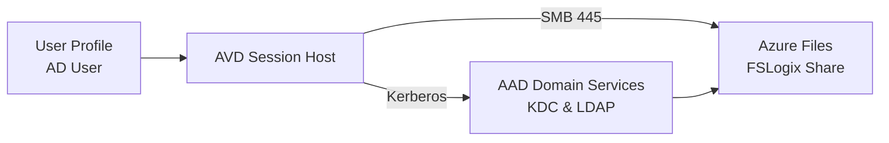
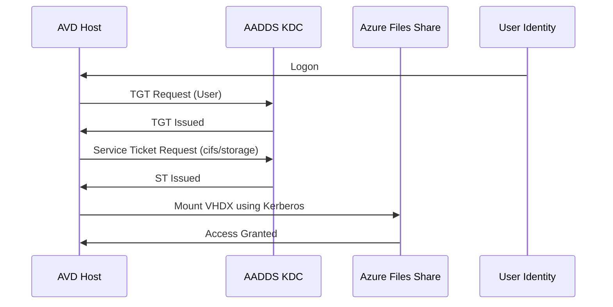
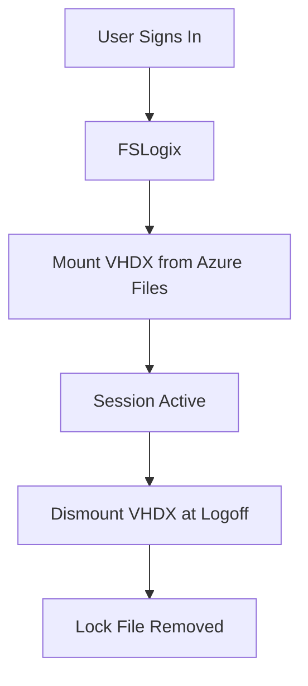

# 03 – Storage & FSLogix Architecture  


---

# 🧭 1. Overview

This document describes the **Storage & FSLogix architecture** for Azure Virtual Desktop (AVD).  
It focuses on:

- Azure Files (Premium) design  
- Kerberos authentication (no storage keys)  
- NTFS & Share permissions  
- FSLogix configuration and tuning  
- VHDX lifecycle  
- Cloud Cache (optional)  
- Performance considerations  

This design mirrors Microsoft's production recommendations.

---

# 🗄️ 2. High-Level Storage Diagram



---

# 📦 3. Storage Account Architecture

### Storage Account Requirements

| Setting | Value |
|---------|--------|
| **Type** | StorageV2 |
| **Performance Tier** | Premium (FileStorage) |
| **Protocol** | SMB |
| **Redundancy** | LRS or ZRS |
| **Auth mode** | **Active Directory (Kerberos)** |
| **Enable Large File Shares** | Required |

### Example naming:
```
stavdprofilesnnn
```

### Required File Share
```
\stavdprofilesnnn.file.core.windows.net\profiles
```

---

# 🔐 4. Kerberos Authentication for Azure Files

Kerberos allows FSLogix to authenticate without:

❌ Access keys  
❌ SAS tokens  
❌ Storing credentials locally  

AADDS handles:

- Machine account authentication  
- User authentication  
- SPN mapping  
- Ticket issuance  

### Kerberos Flow Diagram



---

# 🔧 5. FSLogix Profile Container Architecture

FSLogix mounts a **VHDX container** instead of using local Windows profiles.

### FSLogix Folder Structure
```
\profiles\%username%
    profile_username.vhdx
    profile_username.vhdx.lock
```

### Benefits
- Fast logons  
- Consistent profile state  
- Easy roaming  
- Reduced host image size  

### FSLogix Registry Settings (Standard)

```reg
[HKLM\Software\FSLogix\Profiles]
"Enabled"=dword:1
"VHDLocations"=multi:"\\stavdprofilesnnn.file.core.windows.net\profiles"
"VolumeType"="vhdx"
"IsDynamic"=dword:1
"SizeInMBs"=dword:30000
"FlipFlopProfileDirectoryName"=dword:1
```

---

# 🛑 6. NTFS & Share Permissions (Essential)

## Share Permissions (Azure RBAC)
Assign to **FSLogix-Users** group:

| Role | Purpose |
|------|----------|
| **Storage File Data SMB Share Contributor** | Allows user & host read/write to profiles |

To session host VM **managed identities** (if used):

| Role | Purpose |
|------|----------|
| **Storage File Data SMB Share Contributor** | Required for machine account access |

---

## NTFS Permissions (Inside the Share)

Use the following NTFS ACL:

| Identity | Permissions | Applies To |
|----------|-------------|------------|
| **CREATOR OWNER** | Full Control | Subfolders & Files |
| **FSLogix-Users** | Modify | This Folder, Subfolders, Files |
| **AADDS\Domain Computers** | Read & Execute | This Folder |
| **Administrators** | Full Control | This Folder, Subfolders, Files |

This ensures:

- User owns their VHDX  
- Hosts can read/write  
- Admins retain access  
- No cross-user access possible  

---

# 🌩 7. Cloud Cache (Optional)

Cloud Cache writes profile data to **multiple locations**.

Example configuration:

```reg
[HKLM\Software\FSLogix\Profiles]
"CCDLocations"=multi:"type=smb,connectionString=\\stavdprofilesnnn.file.core.windows.net\profiles;type=local,connectionString=C:\ProfileBackup"
"Enabled"=1
"CloudCacheEnabled"=1
```

Benefits:
- Resiliency  
- Faster reconnect times  

Downside:
- More disk IO  
- Larger local cache footprint  

---

# ⚙️ 8. FSLogix Performance Tuning

### Recommended settings:

| Setting | Value |
|---------|--------|
| `IsDynamic` | **1** (dynamic VHDX) |
| VHDX Size | 30–40 GB for multi-session |
| Disk Type | Premium Files recommended |
| Redirections | Enable redirections.xml to reduce VHD size |

### redirections.xml example:

```xml
<FrxProfileFolderRedirection ExcludeCommonFolders="0">
    <RedirectedFolders>
        <Folder>AppData\Local\Temp</Folder>
        <Folder>AppData\Local\Microsoft\Windows\INetCache</Folder>
        <Folder>AppData\Local\Microsoft\Teams</Folder>
    </RedirectedFolders>
</FrxProfileFolderRedirection>
```

This reduces roaming size & logon time.

---

# 🌀 9. VHDX Lifecycle Flow



Failure normally indicates:

- SMB blocked  
- Kerberos broken  
- Expired password not synced to AADDS  

---

# 🧪 10. Troubleshooting FSLogix

### Common Errors & Fixes

| Error | Cause | Fix |
|--------|--------|------|
| `STATUS_ACCESS_DENIED` | Missing RBAC | Assign SMB contributor |
| Red Screen FSLogix | VHD locked | Delete `.lock` file |
| Profile stuck “Temporary” | Disk full / VHD corruption | Create new profile |
| Slow logons | No redirection | Add redirections.xml |
| VHD not mounting | Kerberos failure | Check DNS + time sync |

### Logs

FSLogix logs live in:

```
C:\ProgramData\FSLogix\Logs\Profiles
```

Key logs:

- `frxsvc.log`
- `profile_log.txt`

---

# ✔ 11. Summary

This design enables:

- Secure, keyless authentication  
- High-performance FSLogix profiles  
- Predictable user experience  
- AVD hosts that scale without profile loss  
- Enterprise-grade identity & storage resiliency  

This document represents a **production-ready FSLogix + Azure Files architecture** suitable for labs, pilots, and enterprise deployments.

---

