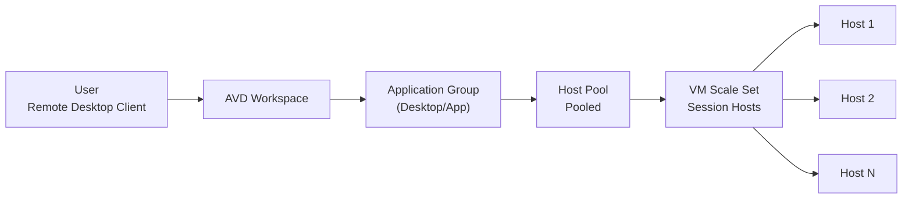
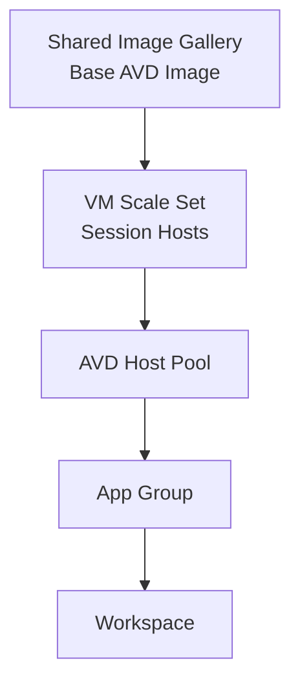
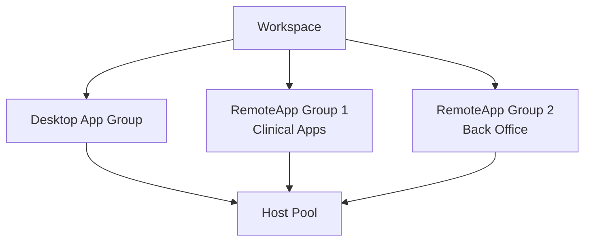
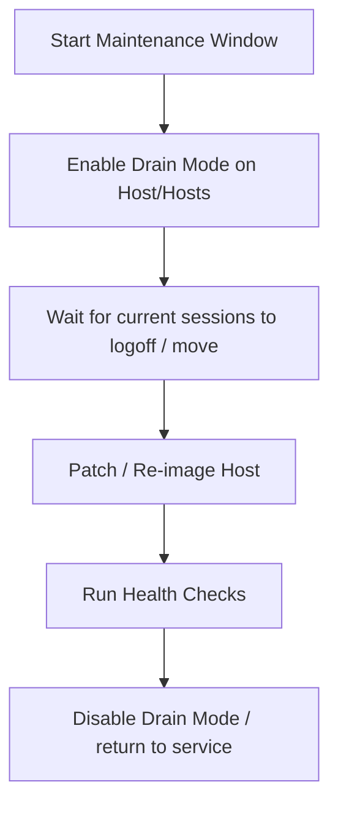
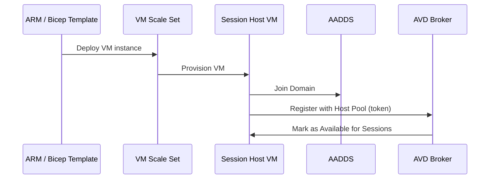

# 04 – Azure Virtual Desktop Host Pools & Session Hosts  


---

# 🧭 1. Overview

This document describes the **host pool and session host architecture** for the Azure Virtual Desktop (AVD) lab.

It covers:

- Host pool types & design  
- VM Scale Set (VMSS) for session hosts  
- Application groups & workspace  
- Density planning (users per host)  
- RDP properties (UX & security)  
- Drain mode & maintenance patterns  
- Deployment & registration flow  

---

# 🗺️ 2. High-Level Host Pool Architecture



---

# 🧩 3. Host Pool Design

### 3.1 Host Pool Type

For this lab (and typical enterprise):

| Setting | Value |
|--------|--------|
| Host pool type | **Pooled** |
| Load balancing | **Depth-first or Breadth-first** |
| Assignment type | Automatic |
| SSO | Where available |

### 3.2 Load Balancing Modes

| Mode | Behaviour | When to use |
|------|-----------|-------------|
| **Breadth-first** | Distribute sessions evenly | Best for UX consistency |
| **Depth-first** | Fill one host at a time | Cost-optimised, good with autoscale |
| **Persistent** | User always returns to same host | For app-sticky workloads |

For the lab, **Depth-first** is often easier to visualise scaling plans.

---

# 💻 4. Session Host Architecture (VMSS)

Session hosts are provisioned via a **Virtual Machine Scale Set (VMSS)**.

### 4.1 VMSS Characteristics

| Setting | Example |
|---------|---------|
| Orchestration mode | **Uniform** |
| SKU | `Standard_D8s_v5` (example) |
| OS | Windows 11 Enterprise multi-session |
| Image Source | Shared Image Gallery (SIG) or Marketplace |
| Disk | Premium SSD |
| Domain Join | AADDS (Kerberos/DNS configured) |
| Network | `AVD-Hosts` subnet in `VNET-AVD-Lab` |



---

# 🧮 5. Capacity & Density Planning (Lab-Scale)

A realistic starting point:

| Metric | Value |
|--------|--------|
| Users per host | 8–12 light users on D8s v5 |
| CPU threshold | 70–80% sustained |
| RAM threshold | 75–80% sustained |
| Max sessions per host | 12–16 (lab) |

> In production, always validate sizing with a pilot group and PerfMon / Log Analytics data.

---

# 🎛 6. RDP Properties (User Experience + Security)

RDP properties are configured at the host pool level.

### Recommended Base RDP Properties

```text
audiocapturemode:i:1;
audiomode:i:0;
redirectclipboard:i:1;
drivestoredirect:s:;  // disable drive redirection by default
redirectprinters:i:1;
redirectcomports:i:0;
redirectsmartcards:i:1;
redirectposdevices:i:0;
redirectwebauthn:i:1;
camerastoredirect:s:0;
devicestoredirect:s:;
networkautodetect:i:1;
bandwidthautodetect:i:1;
enablecredsspsupport:i:1;
redirectwebcam:i:0;
```

Tighten for kiosk-style or healthcare deployments by **disabling** drive, clipboard, and printer redirection where not required.

---

# 🧵 7. Application Groups & Workspace

Each host pool typically has:

- **1 x Desktop Application Group** – full desktop  
- **(Optional) 1+ RemoteApp Groups** – individual apps  



### Assignment Strategy

| Group | Users |
|-------|--------|
| Desktop Group | General users, lab testing |
| RemoteApp (Clinical) | Power users / specific roles |
| RemoteApp (Admin) | Support / ICT staff |

---

# 🔄 8. Drain Mode & Maintenance

Drain mode (a.k.a. `AllowNewSessions = False`) is critical for:

- Host patching  
- Image updates  
- Rolling maintenance  

### Maintenance Flow



### Practical Tips

- For lab: toggle drain mode manually in portal or via PowerShell.  
- For prod: integrate with maintenance pipeline (Azure DevOps or Automation).

---

# 🚀 9. Deployment & Registration Flow

For each session host:

1. VM created via **VMSS scaling** (or direct ARM deployment).
2. **Domain joined** to AADDS.
3. AVD Agent & Boot Loader installed.
4. Host registers with the **Host Pool** using a **registration token**.
5. Host appears as **Available** in AVD.

### Mermaid Flow



---

# 🧰 10. PowerShell / CLI Snippets (Conceptual)

> These are conceptual examples – adapt names to your environment.

### Create Host Pool (CLI)

```bash
az desktopvirtualization hostpool create   --resource-group RG-AVD-Lab   --location australiaeast   --name avd-hp-lab   --type Pooled   --load-balancer-type DepthFirst   --preferred-app-group-type Desktop
```

### Create Desktop Application Group

```bash
az desktopvirtualization applicationgroup create   --resource-group RG-AVD-Lab   --host-pool-name avd-hp-lab   --location australiaeast   --name avd-ag-desktop   --type Desktop
```

### Link Workspace

```bash
az desktopvirtualization workspace create   --resource-group RG-AVD-Lab   --location australiaeast   --name avd-ws-lab

az desktopvirtualization workspace update   --resource-group RG-AVD-Lab   --name avd-ws-lab   --application-group-references "/subscriptions/<subid>/resourceGroups/RG-AVD-Lab/providers/Microsoft.DesktopVirtualization/applicationgroups/avd-ag-desktop"
```

---

# 🧪 11. Common Host Pool Issues & Fixes

| Symptom | Likely Cause | Fix |
|---------|--------------|-----|
| Host shows as `Unavailable` | AVD agent failure | Restart AVD agent service, check logs |
| Users stuck on one host | Load balancing mis-config | Check host pool properties |
| Login failures | Domain join problem | Validate DNS, AADDS, and time sync |
| Session not reconnecting | Assignment type / persistent mode | Adjust host pool assignment |
| Black screen on login | FSLogix or GPU issue | Check profile mount + session host SKU |

Key logs:

- On session host:
  - `C:\ProgramData\Microsoft\RDInfra\RDAgentBootLoader\Logs`
  - `C:\ProgramData\Microsoft\RDInfra\RDAgent\Logs`

---

# ✔ 12. Summary

This host pool and session host design provides:

- Scalable, VMSS-backed AVD infrastructure  
- Clear capacity planning starting point  
- Clean separation of host pool, app groups, and workspace  
- Enterprise-friendly maintenance flow with drain mode  
- Flexibility to support both full desktops and RemoteApps  

It is suitable for:

- Labs & PoCs  
- Pilot deployments  
- Foundation for full enterprise AVD rollouts

---

