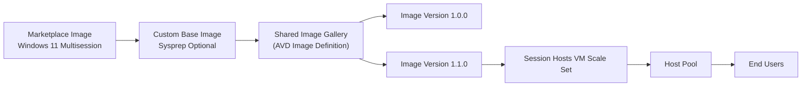
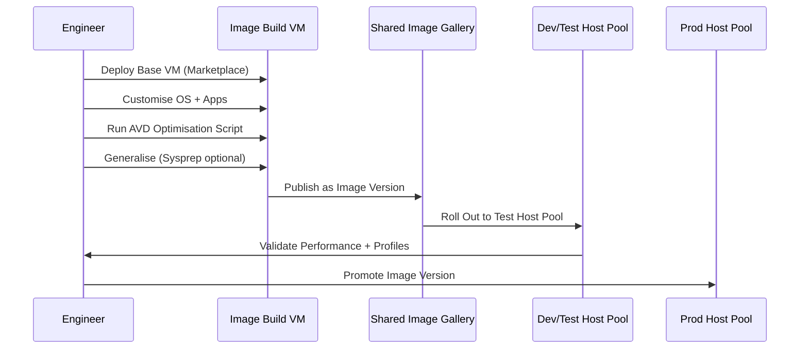
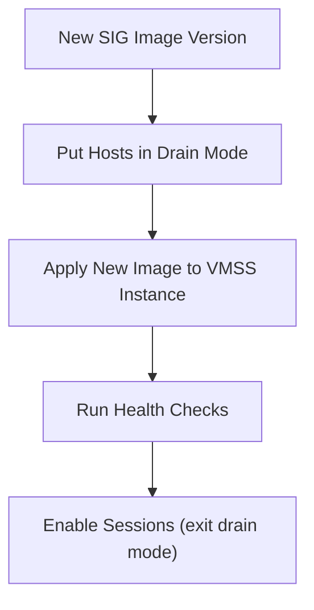

# 05 – Image Management (Shared Image Gallery, Versioning & AVD Lifecycle)


---

# 🧭 1. Overview

This document describes the **Image Management architecture** for Azure Virtual Desktop (AVD), using:

- **Shared Image Gallery (SIG)**  
- **Versioned golden images**  
- **Automated update workflow**  
- **VMSS image rollouts**  
- **Health & validation gates**  

This is the recommended approach for both lab and production-grade AVD deployments.

---

# 🏛️ 2. High-Level Architecture



---

# 🧱 3. Image Strategy

### 🎯 Goals
A good golden image strategy should:

- Reduce host deployment time  
- Improve consistency  
- Reduce patching windows  
- Speed up scale-out events  
- Ensure clean FSLogix readiness  

### 🧩 What goes into the image?

| Category | Recommendation |
|----------|---------------|
| Windows Updates | ✔ Include |
| FSLogix | ❌ Prefer not to bake in (update separately) |
| Teams / WebRTC | ✔ Include (if stable) |
| AVD Agent | ❌ Do **not** include — agent installs at host registration |
| Apps | ✔ Only core apps, avoid frequent changes |
| Optimisations | ✔ Use AVD optimisation script |

---

# 🗃️ 4. Shared Image Gallery (SIG) Architecture

A Shared Image Gallery provides:

- Centralised versioning  
- Rollback capability  
- Regional replication  
- Image lifecycle management  

### Recommended SIG structure

```
Shared Image Gallery:
  AVD-Images
    └── Windows11-MultiSession
         ├── 1.0.0
         ├── 1.1.0
         ├── 1.2.0
         └── Latest
```

### Versioning model (semantic versioning)

| Version | Purpose |
|---------|---------|
| `MAJOR` | Large OS change (Win10 → Win11) |
| `MINOR` | Patch cycle updates, app updates |
| `PATCH` | Hotfix, small tweaks |

Example:
```
1.0.0 → Initial base image
1.1.0 → Monthly patch update
1.1.1 → Teams optimisation fix
1.2.0 → Major app addition
```

---

# ⚙️ 5. Image Build Workflow



---

# 🧪 6. Health Validation Before Promotion

Recommended health checks:

| Check | Why |
|--------|-----|
| Domain Join | AADDS DNS / Kerberos validation |
| FSLogix Mount | Ensure profile container loads |
| CPU/RAM Baseline | Ensure no abnormal processes |
| AVD Agent Status | Should auto-install correctly |
| Login Time | Must be <30 seconds (lab target) |
| Teams Media | Smooth audio/video offload |

Use Event Viewer logs + AVD Insights.

---

# 🔄 7. VMSS Image Rollout

VM Scale Sets support **rolling upgrades** when an image version changes.

### Upgrade modes:

| Mode | Behaviour | Recommended |
|-------|-----------|-------------|
| Manual | You trigger rollout | ✔ For production |
| Automatic | Hosts cycle automatically | ⚠️ Riskier |

### Rolling Upgrade Flow



You control:

- Batch size  
- Pause duration  
- Health probe script  

---

# 📏 8. Sizing Guidance (Image Perspective)

### Don’t include:
- FSLogix profiles  
- Logs  
- Dynamic app data  

### Do include:
- Framework updates  
- Core productivity apps  
- Teams optimisation  
- Edge WebView2 runtime  

### Avoid "image bloat":
Keep image disk size under **128 GB** unless required.  
Use **AVD Optimisation Script** to remove unnecessary features.

---

# 🧹 9. Image Optimisation

Use Microsoft’s official script:

```
https://github.com/The-Virtual-Desktop-Team/Virtual-Desktop-Optimization-Tool
```

Optimises:

- Services  
- Scheduled tasks  
- bloatware  
- Defender exclusions  
- Performance defaults  

---

# 🛠️ 10. Operational Runbook

### Image Update Steps

1. Build new VM  
2. Apply Windows updates  
3. Install apps  
4. Optimise OS  
5. Test domain join + FSLogix  
6. Publish to SIG  
7. Update VMSS image reference  
8. Drain + roll hosts  
9. Validate  
10. Promote version to “Latest”  

### Rollback

To rollback:

- Switch VMSS image to previous SIG version  
- Reimage affected hosts  
- Validate  

SIG makes rollback **almost instantaneous**.

---

# 🧪 11. Troubleshooting

| Symptom | Likely Cause | Fix |
|---------|--------------|-----|
| AVD agent not installing | Used wrong image type | Remove AVD agent from image |
| FSLogix failing | Corrupted profile in test | Reset test user |
| Domain join failure | DNS misconfigured | Check AVD VNET DNS |
| Image deployment stuck | VMSS upgrade mode blocked | Set upgrade mode to manual |
| Login time slow | Missing optimisation | Re-run AVD optimise tool |

---

# ✔ 12. Summary

This image management strategy ensures:

- Fast VM scale-out  
- Repeatable host lifecycle  
- Clean and stable user experience  
- Easy rollback during incidents  
- Predictable monthly patch cycles  

It is suitable for:

- Labs  
- Pilot environments  
- Production environments  

---

