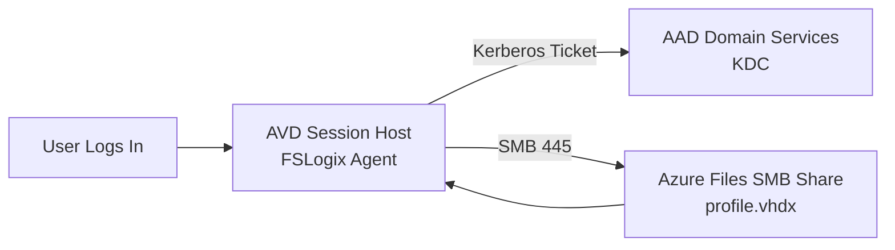
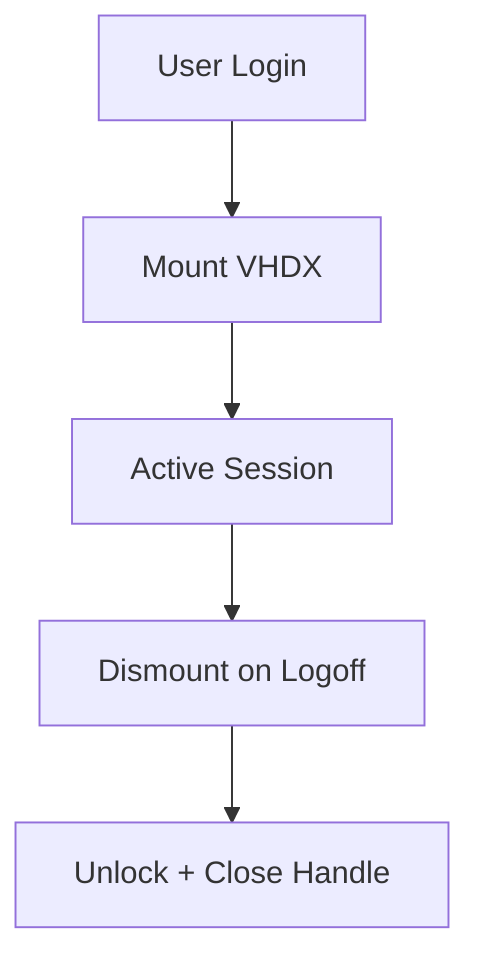

# 06a – FSLogix Configuration


---

# 🧭 1. Overview
This document provides **advanced FSLogix configuration guidance** for Azure Virtual Desktop, covering:

- Profile Container vs Office Container
- Redirections.xml (deep dive)
- Cloud Cache
- VHDX sizing & lifecycle
- Performance tuning
- Troubleshooting & corruption recovery
- Security hardening
- Teams optimisation

---

# 🧱 2. FSLogix Architecture Recap


---

# 🗂️ 3. Profile Container vs Office Container
| Feature | Profile Container | Office Container |
|--------|-------------------|------------------|
| Full Windows profile | ✔ | ❌ |
| Outlook OST | ✔ | ✔ |
| Search roam | ✔ | ✔ |
| Teams cache | ✔ | ✔ |
| Faster login | ❌ | ✔ |

**Recommendation:** Always use **Profile Containers** for AVD.

---

# ⚙️ 4. Core FSLogix Registry Configuration
```reg
[HKLM\SOFTWARE\FSLogix\Profiles]
"Enabled"=dword:1
"DeleteLocalProfileWhenVHDShouldApply"=dword:1
"FlipFlopProfileDirectoryName"=dword:1
"IsDynamic"=dword:1
"SizeInMBs"=dword:30000
"VolumeType"="vhdx"
"VHDLocations"=multi:"\\\\stavdprofilesnnn.file.core.windows.net\\profiles"
"PreventLoginWithFailure"=dword:1
"ShutdownWhenRemoveFails"=dword:1
```

---

# 🧹 5. Redirections.xml (Advanced)
```xml
<FrxProfileFolderRedirection ExcludeCommonFolders="0">
  <RedirectedFolders>
    <Folder>AppData\Local\Temp</Folder>
    <Folder>AppData\Local\Microsoft\Windows\INetCache</Folder>
    <Folder>AppData\Local\Microsoft\Edge</Folder>
    <Folder>AppData\Local\Microsoft\Teams</Folder>
    <Folder>AppData\LocalLow</Folder>
    <Folder>AppData\Local\CrashDumps</Folder>
  </RedirectedFolders>
</FrxProfileFolderRedirection>
```

Place in:
```
C:\Program Files\FSLogix\Apps\Redirections.xml
```

---

# 🌩️ 6. Cloud Cache (High Availability)
```reg
[HKLM\SOFTWARE\FSLogix\Profiles]
"CCDLocations"=multi:"type=smb,connectionString=\\\\stavdprofilesnnn.file.core.windows.net\\profiles;type=smb,connectionString=\\\\backupsa.file.core.windows.net\\profiles"
"CloudCacheEnabled"=dword:1
```

Pros: resilience, faster reconnect  
Cons: IO-heavy, more troubleshooting

---

# 📦 7. VHDX Sizing & Lifecycle

### Recommended:
- Dynamic VHDX
- **30–40 GB** base size
- Increase for heavy Teams/OneDrive

### Lifecycle


---

# 🧰 8. Logs & Troubleshooting
```
C:\ProgramData\FSLogix\Logs\Profiles
```

Logs:
- `frxsvc.log`
- `profile_load.log`
- `frxdrv.log`

---

# 🚀 9. Teams Optimisation
```reg
[HKLM\SOFTWARE\Microsoft\Teams]
"IsWVDEnvironment"=dword:1
```

Also ensure:
- WebRTC redirector installed
- Teams cache redirected via Redirections.xml

---

# 🔐 10. Security Hardening
- Use **RBAC**, not storage keys
- NTFS:
  - Users = Modify
  - Domain Computers = Read
  - Admins = Full Control
- Enforce Kerberos-only auth where possible

---

# 🧪 11. Troubleshooting Matrix
| Symptom | Cause | Fix |
|--------|--------|------|
| Temp profile | Cannot mount VHDX | Check Kerberos/DNS/RBAC |
| Black screen | FSLogix hang | Validate redirections.xml |
| Logged out | Locked VHDX | Remove `.lock` |
| Slow login | Large VHD | Add redirections |
| OST issues | Office Container off | Enable Office Container |

---

# ✔ 12. Summary
This advanced FSLogix configuration provides:

- High performance and fast logons  
- Stable roaming profiles  
- Reduced VHDX bloat  
- Secure Kerberos-based access  
- Production-ready Teams support  
- Strong troubleshooting patterns  

Perfect for enterprise AVD or optimised lab deployments.

---
