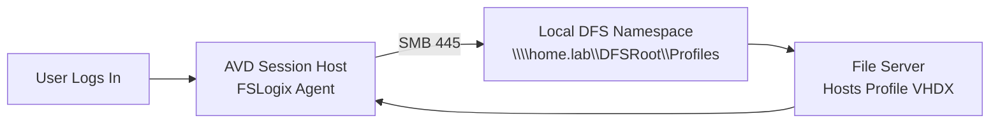
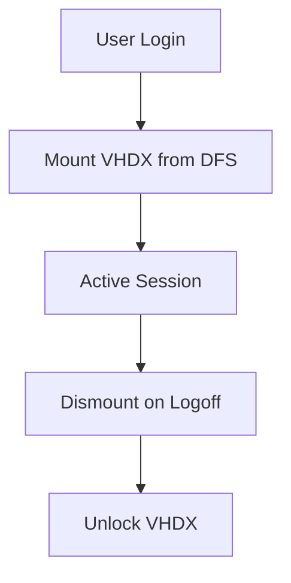

# 06b – FSLogix Configuration (Local SMB/DFS Edition)


---

# 🧭 1. Overview  
This document provides the **advanced FSLogix configuration for Local SMB/DFS storage**, using:

```
\\home.lab\DFSRoot\Profiles
```

This mode simulates **real enterprise FSLogix deployments** (like Cabrini) but without Azure Files.  
It supports:

- Multi–session host AVD  
- Kerberos or NTLM authentication  
- DFS namespace & file server resiliency  
- True roaming FSLogix profile containers  

This is the **correct architecture for your home lab** when you want to mirror real-world enterprise AVD behaviour.

---

# 🧱 2. Architecture – DFS-backed FSLogix  



### How it works  
FSLogix dynamically mounts:

```
\\home.lab\DFSRoot\Profiles\<user>\<SID>.vhdx
```

This matches enterprise behaviour **exactly**, except storage lives on your home server.

---

# 🗂️ 3. FSLogix Containers Overview

| Feature | Profile Container | Office Container |
|--------|-------------------|------------------|
| Full Windows profile | ✔ | ❌ |
| OST caching | ✔ | ✔ |
| Teams cache | ✔ | ✔ |
| Better login speed | ❌ | ✔ |
| Recommended for AVD | ✔ | Conditional |

Recommendation:  
**Use Profile Container**, and optionally Office Container if you want OST/search split testing.

---

# ⚙️ 4. Required DFS Folder Structure

### Create DFS path:
```
\\home.lab\DFSRoot\Profiles
```

### On the file server (FS01):
```
D:\FSLogix\Profiles
```

### Map DFS to backend:
```
DFSRoot
 └── Profiles → \\FS01.home.lab\FSLogixProfiles$
```

---

# 🔐 5. NTFS + Share Permissions (Enterprise Standard)

### **Share permissions** (FSLogixProfiles$)
| Identity | Permission |
|----------|------------|
| Everyone | Full Control (share only) |

### **NTFS permissions**  
On the backend folder (`D:\FSLogix\Profiles`):

| Identity | Permission |
|----------|------------|
| SYSTEM | Full Control |
| Administrators | Full Control |
| Domain Computers | Read & Execute |
| Domain Users | Modify |

This is **identical to Azure Files hybrid mode**.

---

# ⚙️ 6. FSLogix Registry Configuration (DFS Mode)

Use your DFS path:

```reg
[HKLM\SOFTWARE\FSLogix\Profiles]
"Enabled"=dword:1
"VolumeType"="vhdx"
"IsDynamic"=dword:1
"SizeInMBs"=dword:30000
"DeleteLocalProfileWhenVHDShouldApply"=dword:1
"FlipFlopProfileDirectoryName"=dword:1
"PreventLoginWithFailure"=dword:1
"VHDLocations"=multi:"\\\\home.lab\\DFSRoot\\Profiles"
```

This registry configuration works for:

- AADDS joined session hosts  
- On-prem AD joined session hosts  
- NTLM fallback scenarios  

---

# 🧹 7. Redirections.xml (Same as Enterprise Azure)

Place at:

```
C:\Program Files\FSLogix\Apps\Redirections.xml
```

Recommended config:

```xml
<FrxProfileFolderRedirection ExcludeCommonFolders="0">
  <RedirectedFolders>
    <Folder>AppData\Local\Temp</Folder>
    <Folder>AppData\Local\Microsoft\Windows\INetCache</Folder>
    <Folder>AppData\Local\Microsoft\Edge</Folder>
    <Folder>AppData\Local\Microsoft\Teams</Folder>
    <Folder>AppData\LocalLow</Folder>
    <Folder>AppData\Local\CrashDumps</Folder>
  </RedirectedFolders>
</FrxProfileFolderRedirection>
```

---

# 🌩️ 8. Cloud Cache (Optional but Supported)

You can run Cloud Cache with DFS:

```reg
[HKLM\SOFTWARE\FSLogix\Profiles]
"CloudCacheEnabled"=dword:1
"CCDLocations"=multi:"type=smb,connectionString=\\\\home.lab\\DFSRoot\\Profiles;type=smb,connectionString=\\\\fs02.home.lab\\ProfilesBackup"
```

Benefits:

- Resilience testing  
- Faster reconnect  
- Identical behaviour to Cloud Cache on Azure Files  

---

# 📦 9. VHDX Sizing Guidance

| Workload Type | Recommended VHDX Size |
|---------------|------------------------|
| Home Lab | 10–20 GB |
| Standard AVD Desktop | 20–30 GB |
| Teams/Office Heavy | 30–40 GB |

VHDX Lifecycle diagram:



---

# 🧰 10. FSLogix Logs & Diagnostics

Path:

```
C:\ProgramData\FSLogix\Logs\Profiles
```

Key logs:

- frxsvc.log  
- profile_load.log  
- frxdrv.log  

These logs behave identical regardless of storage backend.

---

# 🚀 11. Teams Optimisation

Enable AVD-optimised Teams mode:

```reg
[HKLM\SOFTWARE\Microsoft\Teams]
"IsWVDEnvironment"=dword:1
```

Account for:

- Teams cache redirected by XML  
- WebView2 preinstalled  
- Use the new Teams client if testing modern setups  

---

# 🔐 12. Security Hardening (DFS Version)

### Recommended for home-lab production simulation:

- Enable **Kerberos** (if host is domain joined)  
- Avoid NTLM if possible  
- BitLocker your FS server volumes  
- Limit admin access  
- Apply disk quotas if needed  
- DFS-R optional for multi-server redundancy  

This layout mirrors real hospitals/enterprise FSLogix deployments.

---

# 🧪 13. Troubleshooting Matrix

| Symptom | Cause | Fix |
|--------|--------|-----|
| Temp profile | VHD path inaccessible | Check SMB, DFS namespace |
| Profile not mounting | NTFS denies access | Reapply NTFS perms |
| `.lock` file persists | Improper unmount | Delete lock → retry login |
| Black login screen | Profile bloat | Trim VHD + apply redirections |
| Slow login | DFS referral delays | Add static DFS referral |
| Profile corruption | Host crash | Reset VHDX |

---

# ✔ 14. Summary

The DFS-backed FSLogix configuration:

- Fully mirrors enterprise FSLogix deployments  
- Works with multiple AVD session hosts  
- Requires only NTFS + SMB  
- Supports Kerberos if domain joined  
- Eliminates Azure Files cost in home lab  
- Provides real-world troubleshooting practice  
- Perfectly aligns with **Cabrini-style AVD architecture**  

This is the **correct FSLogix storage model** for your home AVD learning environment.

---

