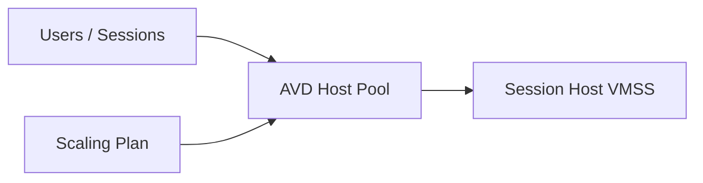
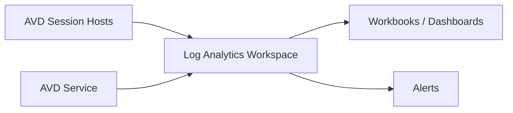

# 07 – Autoscale & Monitoring for Azure Virtual Desktop


---

# 🧭 1. Overview

This document describes **Autoscale & Monitoring** for Azure Virtual Desktop (AVD) in the lab, designed to mirror production patterns in a simplified way.

It focuses on:

- AVD **Scaling Plans** (native autoscale)
- VM Scale Set (VMSS) autoscale concepts
- Sizing rules and thresholds
- Monitoring via Log Analytics & Workbooks
- Key metrics for capacity, performance, and stability
- Alerting patterns & troubleshooting signals

This builds on the previous docs (Networking, Host Pools, FSLogix, Image Management).

---

# ⚖️ 2. Autoscale Approaches

Two main autoscale layers can be used with AVD:

| Layer | What it manages | Typical Usage |
|-------|-----------------|---------------|
| **AVD Scaling Plans** | AVD host pool session capacity | Primary for multi-session AVD |
| **VMSS Autoscale** | Raw VM instance count | Under the hood / advanced scenarios |

For the lab (and most real-world AVD multi-session scenarios), **use AVD Scaling Plans** first.

---

# 🗺️ 3. AVD Scaling Plan Architecture



The **Scaling Plan** tells AVD when to:

- Start hosts
- Put hosts in drain mode
- Scale in / scale out session capacity

It works at the *host pool* level, not just the VMSS.

---

# ⏰ 4. Time-based vs Load-based Autoscale

### Time-based scaling
- Uses a schedule (e.g., weekdays 7am–7pm)
- Defines minimum and maximum session capacity
- Often enough for predictable organisations

### Load-based scaling
- Uses metrics: session count / CPU / memory
- Attempts to keep **session density** healthy
- More dynamic, more complex

In the lab, start with **time-based + session thresholds** and layer in CPU thresholds later.

---

# 📐 5. Example Scaling Plan (Lab Weekday)

Assume:

- Working hours: 8:00–18:00
- Up to 20 concurrent users
- Each host supports 10 sessions comfortably

You need **2 hosts at peak**, but can run less off-peak.

| Time | Min Hosts | Max Hosts | Notes |
|------|-----------|-----------|-------|
| 06:30–08:00 | 1 | 2 | Warm-up window |
| 08:00–17:00 | 2 | 2 | Full capacity |
| 17:00–19:00 | 1 | 2 | Wind-down |
| 19:00–06:30 | 0 | 1 | Night / on-demand |

Scaling Plan logic:

- Before 08:00 → ensure enough hosts are available
- After 17:00 → place hosts into drain mode and scale in when idle
- Nights/weekends → allow 0 or 1 session host running

---

# 🎛️ 6. AVD Scaling Plan Core Concepts

### Key properties:

- **Host Pool association** – which pools the plan applies to
- **Ramp up** – how quickly new hosts come online
- **Peak hours** – required session capacity
- **Ramp down** – when to start draining sessions
- **Off-peak** – minimum capacity when demand is low

### Drain Mode behaviour

When scaling in, AVD:

1. Puts chosen hosts into **drain mode** (no new sessions)
2. Waits for existing sessions to log off (with a timeout)
3. Deallocates the VM when idle

This behaviour **aligns with your Host Pools & VMSS doc** and avoids kicking users out mid-session.

---

# 💡 7. Session-based Autoscale Logic

Typical rules:

- **Max sessions per host:** e.g. 10–15
- When a host reaches that limit → spin up a new host
- When a host remains under a certain threshold for a long period → consider scaling in

For the lab, a simple model:

```text
MaxSessionsPerHost = 10
If active_sessions_per_host >= 10 → allow next host
If active_sessions_on_host = 0 for 30+ mins → scale in
```

You can simulate this via Scaling Plan configuration using **"capacity threshold"** logic.

---

# 🧮 8. VM Scale Set Autoscale (Conceptual)

Even when using AVD Scaling Plans, **session hosts live in a VMSS**.

VMSS Autoscale can control:

- Min / max instance count
- Instance scale-in / scale-out rules based on:
  - CPU
  - Memory (via custom metrics)
  - Schedule

In many AVD designs:

- AVD Scaling Plan = primary logic
- VMSS Autoscale = safety net (min/max bounds)

For the lab, you can **fix the VMSS capacity** and let the Scaling Plan handle host availability, or configure VMSS to auto-roll new instances on failures.

---

# 📊 9. Monitoring Architecture



### Components:

- **Azure Monitor / Log Analytics**
- **Diagnostic settings** on:
  - Host pools
  - Session hosts
  - AVD objects
- **Workbooks** for AVD Insights
- **Alerts** on key signals

---

# 📡 10. Key Metrics to Watch

### Capacity & Usage

| Metric | Why it matters |
|--------|----------------|
| Active sessions per host | Density, sizing |
| Total active sessions | Overall usage |
| Disconnected vs active sessions | Licence & capacity impacts |
| Host availability | Detect down / failed hosts |

### Performance

| Metric | Why it matters |
|--------|----------------|
| CPU % | Contention / scaling need |
| RAM % | Oversubscription risk |
| Disk queue length | Profile & app IO contention |
| Logon duration | UX indicator |

### FSLogix / Profile-related

- Profile load time
- VHD mount failures
- Number of profile load retries

These are typically found via FSLogix logs + Windows Event Logs aggregated into Log Analytics.

---

# 📜 11. Example KQL Queries (Conceptual)

> Note: These are conceptual examples – adjust table names/workspace as needed.

### 11.1 – Active Sessions per Host

```kusto
WVDConnections
| where TimeGenerated > ago(1h)
| summarize ActiveSessions = count() by SessionHostName
| order by ActiveSessions desc
```

### 11.2 – Average Logon Time

```kusto
WVDConnections
| where TimeGenerated > ago(24h)
| summarize AvgLogonTime = avg(LogonDuration) by UserPrincipalName
| order by AvgLogonTime desc
```

### 11.3 – Session Hosts with High CPU

```kusto
Perf
| where TimeGenerated > ago(30m)
| where ObjectName == "Processor" and CounterName == "% Processor Time" and InstanceName == "_Total"
| summarize AvgCPU = avg(CounterValue) by Computer
| where AvgCPU > 80
| order by AvgCPU desc
```

These types of queries feed both **dashboards** and **alerts**.

---

# 🚨 12. Alerting Patterns

### Recommended alerts for lab (and prod-aligned setups):

| Alert | Condition | Action |
|-------|-----------|--------|
| Host CPU high | CPU > 85% for 10 mins | Email / Teams / webhook |
| Host unavailable | Heartbeat missing | Notify & investigate |
| Logon duration high | Avg > 45s | Trigger investigation |
| FSLogix mount errors | Count > threshold | Check storage / FSLogix config |
| Scaling failure | Host start/deallocation errors | Infra review |

In a real deployment, these would create tickets and notify on-call staff. In the lab, they help you learn what “normal vs broken” looks like.

---

# 🧪 13. Troubleshooting Autoscale

| Symptom | Likely Cause | Fix |
|---------|-------------|------|
| Hosts not starting on schedule | Scaling Plan misconfigured or disabled | Check plan association & schedule |
| Users all piling onto one host | Incorrect max sessions / load balancing | Review host pool settings |
| Hosts never scaling in | Drain mode never triggers / session threshold | Check idle thresholds |
| Frequent scale in/out flapping | Thresholds too aggressive | Increase hysteresis / cooldown |
| Sessions dropped during scale in | Drain mode not respected | Confirm "Allow new sessions" toggle logic |

---

# ✔ 14. Summary

This autoscale & monitoring approach gives you:

- Realistic, production-like behaviour in your lab
- Time-based + session-based autoscale via AVD Scaling Plans
- Clear capacity and performance visibility via Log Analytics
- Insightful metrics and alerting patterns
- A strong foundation to extend into full enterprise monitoring later

---
