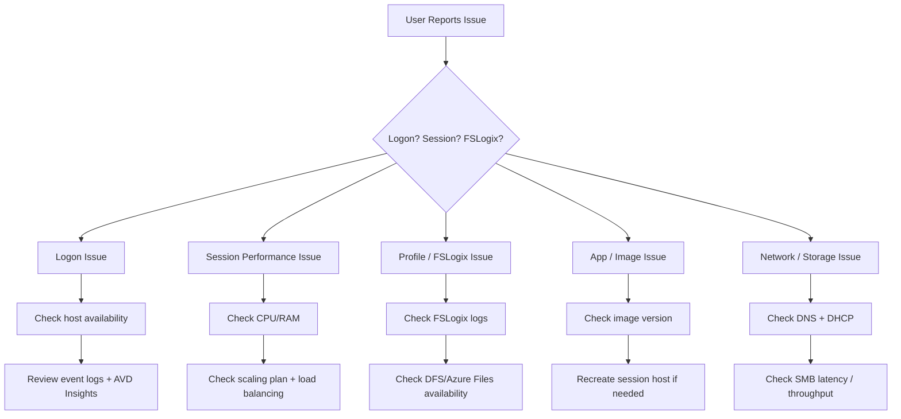

# 08 – AVD Troubleshooting & Runbooks


---

# 🧭 1. Overview
This document provides the **complete troubleshooting and operational runbook** for Azure Virtual Desktop (AVD), aligned with enterprise support models but simplified for your home lab.

It covers:

- Session host issues  
- FSLogix failures  
- Profile corruption  
- Authentication & domain join errors  
- Scaling/availability issues  
- Performance bottlenecks  
- Network/latency issues  
- Storage bottlenecks  
- Log Analytics queries  
- Step-by-step runbooks  

---

# 🧱 2. High-Level Troubleshooting Flow



---

# 🧩 3. AVD Logon Failures – Root Causes & Fixes

| Symptom | Root Cause | Fix |
|---------|------------|-----|
| Black screen at login | FSLogix hang / VHD mount delay | Check FSLogix logs, redirections.xml |
| Login stuck at "Welcome" | DNS or AADDS authentication delay | Validate DNS IPs on NIC, ensure reachability |
| "No resources available" | Host pool capacity exhausted | Verify scaling plan & host availability |
| Random login failures | Registration token expired | Re-register host(s) |
| Cannot reach workspace | RDP client / URL issue | Reset feed, re-authenticate |

### Quick Checks
- Can you RDP to host internally?  
- Does `qwinsta` show ghost sessions?  
- Is host in **Available** state in AVD?  

---

# 🧊 4. Session Host Registration Issues

### When a host shows:  
❌ Unavailable  
❌ Needs Assistance  
❌ No heartbeat  

Perform:

1. Restart AVD Agent & Bootloader  
```
Restart-Service RDAgentBootLoader
Restart-Service RDAgent
```

2. Check registration info:
```
Get-RDAgent -Verbose
```

3. Re-register with token if necessary.

---

# 📦 5. FSLogix Profile Issues

These account for **60–80%** of user-facing issues in real AVD environments.

### Common Symptoms & Fixes

| Symptom | Cause | Fix |
|---------|--------|----|
| Temporary profile | VHDX failure | Check permissions, mount errors |
| Slow login | Bloated VHDX / large cache | Apply redirections.xml |
| Profile not updating | VHDX lock file exists | Delete `.lock` file |
| App settings missing | Corrupt registry hive | Reset NTUSER.DAT inside VHDX |
| OST corruption | Office container misconfig | Enable ODFC or rebuild OST |

### Logs to check:
```
C:\ProgramData\FSLogix\Logs\Profiles
```

---

# ⚡ 6. Performance Issues

| Symptom | Cause | Fix |
|---------|--------|-----|
| High CPU | Too many users per host | Adjust density, scale out |
| High RAM | Teams/Edge heavy load | Increase RAM or reduce users |
| Slow app launch | Disk IO bottleneck | Optimise image, check storage |
| Profile load slow | DFS/Azure Files latency | Check SMB throughput |

### VM Perf Counters (collect via Log Analytics)
- `% Processor Time`
- `Committed Bytes`
- `Disk Queue Length`
- `LogicalDisk Read/Write`

---

# 🔐 7. Authentication Issues (Entra / AADDS)

### Symptoms:

- Users cannot sign in  
- Hosts cannot join domain  
- Kerberos failures  
- Group membership not applying  

### Fixes:

1. Check DNS resolution:
```
nslookup home.lab
```
2. Validate domain join:
```
Test-ComputerSecureChannel
```
3. Ensure AVD NIC DNS = domain controllers

---

# 📡 8. Networking Issues

| Issue | Cause | Fix |
|--------|--------|-----|
| Host unreachable | NSG / routing issue | Verify default route & NSGs |
| SMB drops (DFS/Azure Files) | Latency / throttling | Check bandwidth & SMB MTU |
| Users disconnect randomly | Idle timers | Adjust AVD RDP properties |
| Authentication slow | DNS misconfiguration | Set primary DNS to DC |

### Tools:

- `Test-NetConnection -Port 445`
- `dsregcmd /status`
- AVD Connection Quality in Azure Portal

---

# 🪵 9. Key Logs to Collect

### On AVD Session Hosts
```
C:\ProgramData\Microsoft\RDInfra\RDAgent\LogsC:\ProgramData\Microsoft\RDInfra\RDAgentBootLoader\LogsC:\Windows\EventLogsC:\ProgramData\FSLogix\Logs```

### In Azure
- Log Analytics Workspace  
- AVD Insights Workbook  
- AVD Connection Diagnostics  

---

# 📊 10. KQL Troubleshooting Queries

### Failed Logons per Host
```kusto
WVDConnections
| where State == "Failed"
| summarize count() by SessionHostName, FailureReason
```

### FSLogix Mount Failures
```kusto
Event
| where EventLog == "FSLogix-Apps/Operational"
| where EventLevelName == "Error"
```

### Hosts with Slow Logons
```kusto
WVDConnections
| summarize AvgLogonTime = avg(LogonDuration) by SessionHostName
| where AvgLogonTime > 30000
```

### CPU Hotspots
```kusto
Perf
| where CounterName == "% Processor Time"
| summarize avg(CounterValue) by Computer
| where avg_CounterValue > 85
```

---

# 🧪 11. Runbook – Host is Unavailable

1. Log in via Azure Serial Console or RDP  
2. Check AVD agent status  
3. Restart RDAgentBootLoader  
4. Run:
```
Get-RDAgent -Verbose
```
5. Review event logs  
6. Verify FSLogix mounts  
7. Reboot host  
8. Re-register with token if required  

If still failing → **reimage host** (VMSS handles this easily).

---

# 🧹 12. Runbook – Profile Corruption

1. Identify user  
2. Search DFS/Azure Files profile path  
3. Check for `.lock` file — delete it  
4. Try FSLogix “compact”  
5. If corrupt → rename profile folder to:
```
<user>_backup_YYYYMMDD
```
6. User logs in and generates a clean profile

---

# 🚀 13. Runbook – Slow Logons

1. Check FSLogix logs  
2. Identify large folders in VHDX  
3. Update redirections.xml  
4. Compact VHDX  
5. Confirm Teams optimisation  
6. Check DNS response time  
7. Validate AVD Insights logon breakdown  

---

# ✔ 14. Summary

This troubleshooting & runbook guide provides:

- End-to-end process coverage  
- Quick diagnosis flow for AVD issues  
- FSLogix-rooted troubleshooting (most common)  
- Monitoring signals & KQL queries  
- Operational steps for host recovery, scaling faults, profile repairs  

---

